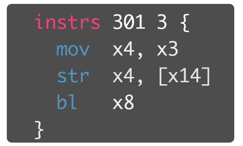

# haiku
Binary patch macro assembler generating IPS files.
<p align="center"></p>

```
USAGE:
    haiku [OPTIONS] <HAIKU_NAME> <IPS_NAME>

ARGS:
    <HAIKU_NAME>    Input file
    <IPS_NAME>      Generated output file

OPTIONS:
    -a, --architecture <ARCHITECTURE>  Keystone assembler backend to use [default: aarch64]
    -h, --help                         Print help information
    -l, --little-endian                Determine endianness of ASSEMBLER output. byte patches are unaffected
    -s, --address-size <ADDRESS_SIZE>  n-bit address. Valid values: 16, 32, 64 (optional)
    -V, --version                      Print version information
```

Note that when using ARM architectures, yoou **should not** set a processor address size.

## Why haiku?
When writing and maintaining binary patches, it can be inconvenient to byte count whenever making changes. Haiku will:
- Keep track of the bytes used by your patch in the space you've allotted
- Let you mix raw byte patches and instruction patches with documentation
- Automatically `nop` pad the regions you've allocated for your patch.
- Macro support for some common operations
  - Loading large immediates on aarch64 (coming soon)
  - Loading IEEE-754 immediates on aarch64 (coming soon)
  - Absolute to relative address translation support


## Syntax
```
// This is a comment, any line that starts with `//' will be ignored
// by the patch generation system

// empty lines are also ignored.

// patches starting with `bytes' will consist of a series of
// 1 or more 2-hex-digit numbers representing bytes to be inserted
// inline.
// The first number after `bytes' is the IPS start address.
// The second number is how many bytes are allowed to go in
// this patch.
// A patch will not be generated if it exceeds this number.
bytes 304F4 10 {
    // bytes can be separated by any amount of whitespace
    00 0F F1 41 41
    41 41 3F 3F 3F
}

// whatever instruction set is set in the assembler directive
// will be used to assemble all instructions.
instrs 30600 2C {
    // an instruction can be prefixed by whitespace
    // there can be a maximum of one instruction per line.
    fmov s0, wzr
    ldrb x0, [x8, #0x30]

    // macros are prefixed with ! and will have platform dependent implementations.
    !call #0xC1321
}
```

## Architecture list
- `arm`
- `aarch64`
- `x86`
- `mips`
- `ppc`
- `sparc`
- `systemz`
- `hexagon`
- `max`

Note that there is not _yet_ any support for enabling ARM thumb mode.

## Macros
### aarch64
- `!call` translates to relative-address branch-with-link.
- `!jump` translates to relative-address branch.

## Related Projects
- [Keystone Assembler](https://github.com/keystone-engine/keystone) - the backend of this project.
- [Basic Assembler](https://github.com/Tsukihimates/Tsukihime-Translation/tree/main/tools/assembler) - the precursor to this project.
